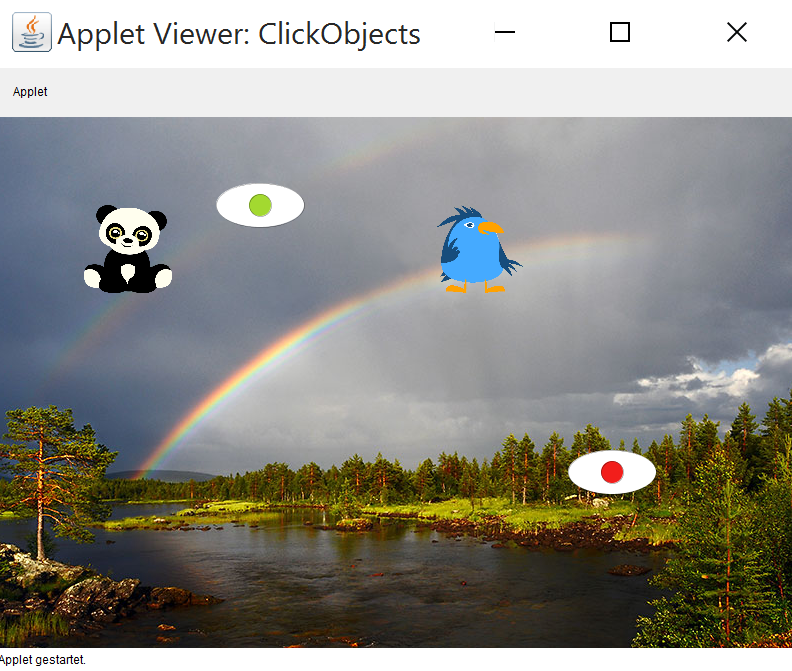
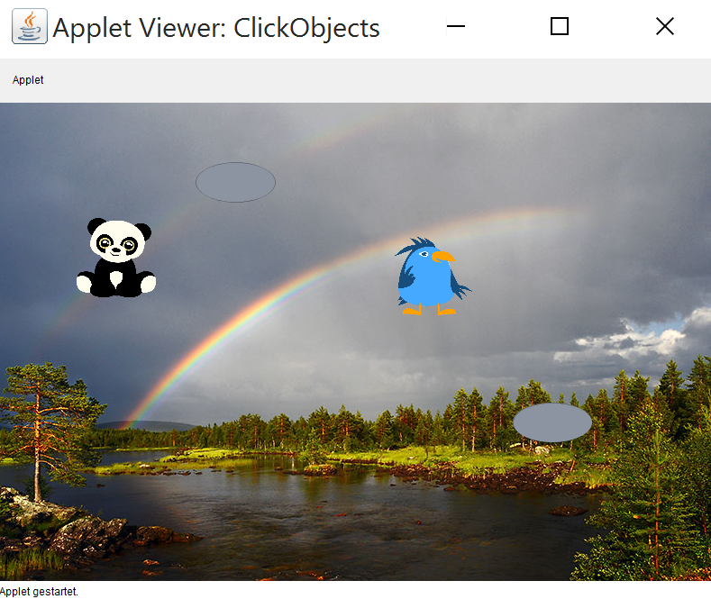
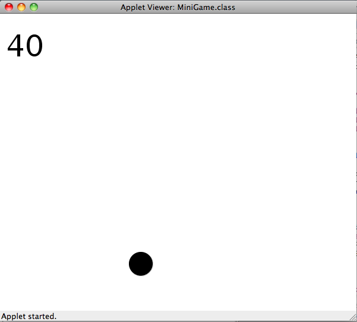

---
author:	Alexander Bazo
date: 11. September 2019
---

## Übung zur Einführung in die objektorientierte Programmierung mit Java

# Übungsblatt 7

### **Klickbare Objekte [gemeinsam bearbeiten]**

In dieser Aufgabe sollen Sie mehreren Objekten die Fähigkeit geben,
klickbar zu sein. Dabei sollen die verschiedenen Objekte jeweils anders
reagieren. Der Panda und der Vogel sollen ihre Position verändern. Die
Augen sollen zwischen offen und geschlossen (= grau) wechseln.
Implementieren Sie zwei Klassen **Animal** und **Eye**, welche beide das
vorgegebene Interface **Clickable** implementieren. Der Hintergrund soll
auf das Bild `rainbow.jpg` gesetzt werden.

Um die Klicks auch an die Klassen weitergeben zu können, müssen Sie mit `public void mouseClicked(MouseEvent e)` Klicks auf den Canvas abfragen und an Ihre Objekte weiterleiten.

Drückt der Nutzer auf eine vorher festgelegte Taste zum Neustart, soll
dieses Ereignis über `public void keyPressed(KeyEvent e)` abgefangen und behandelt werden.

**Tipps:**

-   In dieser Aufgabe müssen beide Methoden des Interfaces `Clickable`
    für die Klassen `Animal` und `Eye` implementiert werden, sowohl
    `onClick`, als auch `wasClicked`.

-   Erzeugen Sie in der ClickObjects-Klasse ein Array mit Clickables      und füllen Sie es mit `Animal`s und `Eye`s.

-   Die Klassen unterscheiden sich nicht nur in ihrem Klickverhalten,
    sondern auch in der Darstellung. Während `Animal` als `Image` der
    `GraphicsApp` dargestellt wird, werden für `Eye` geometrische Formen
    verwendet.

### **Minigame mit Mausklick [vorbereiten]**

Erstellen Sie ein kleines Reaktionsspiel. Ziel des Spiels ist es einen
Ball, der sich innerhalb der Grenzen des Fensters linear bewegt, mit der
Maus zu treffen. Berührt der Ball eine der Seiten, prallt er von der
Wand ab. Schafft es der Nutzer, den Ball zu treffen in dem er mit der
Maus auf diesen klickt, erhöht sich die Geschwindigkeit des Balls um
eins. Gleichzeitig erhöht sich die Punktzahl des Spielers um 10. Klickt der Benutzer daneben, erhöht sich die Geschwindigkeit des Balls
ebenfalls um eins und dem Spieler werden 10 Punkte abgezogen.

**Tipps:**

-   Implementieren Sie eine eigene Klasse für den Ball, die von Ellipse
    erbt und zusätzlich die Methoden
    `checkWallCollision(int width, int height)`\
    und `checkMouseHit(MouseEvent e)` implementiert. (Beachten Sie dazu
    später unbedingt die folgende Aufgabe Vererbung vs. Composition).

-   Implementieren Sie auch für den Punktestand eine eigene Klasse die
    Methoden zur Veränderung des Punktestands besitzt.

-   Sie benötigen wieder eine `GraphicsApp`, in der Sie den Ball und den
    Punktezähler erzeugen. Übergeben Sie bei der Kollisionabfrage die
    Breite und Höhe der Spielfläche an die Methode
    `checkWallCollision(int width, int height)` des Balls. Übergeben Sie
    dem Ball ebenfalls das `MouseEvent`, wenn der Nutzer auf die
    Spielfläche geklickt hat.

### **Vererbung vs. *Composition* [vorbereiten]**

Grundsätzlich haben Sie zwei Möglichkeiten, die Aufgabe Minigame zu
lösen. In beiden Fällen sieht der Client-Code identisch aus.

**Codebeispiel Client Code für beide Varianten**

    public class BallApp extends GraphicsApp {
        public void setup() {
            Ball ball = new Ball(10, 10);
            ball.move(5, 5);
        }
    }

Die erste Möglichkeit nutzt das Prinzip **Vererbung**. In dieser
Variante lassen Sie Ihre `Ball`-Klasse direkt von `Ellipse` erben und
somit stehen Ihnen als Implementor und Client alle öffentlichen Methoden der Klasse `Ellipse` zur Verfügung.

**Codebeispiel Vererbung**

    public class Ball extends Ellipse {
        public Ball(int width, int height) {
            super(width, height, 20, 20, Color.BLACK);
        }
    }

In der zweiten Variante erstellen Sie die Klasse `Ball` ohne Vererbung
und packen stattdessen die `Ellipse` als Instanzvariable in die Klasse
`Ball` (**Composition**).

**Codebeispiel Composition**

    public class Ball  {
        private Ellipse ball;
        
        public Ball(int width, int height) {
            ball = new Ellipse(width, height, 20, 20, Color.BLACK);
        }
        
        public void move(int xDiff, int yDiff) {
            ball.move(xDiff, yDiff);
        }
    }

Mit beiden Ansätzen lässt sich die Aufgabe MiniGame lösen.

Beantworten Sie die folgenden Fragen:

1.  Welche Vor- und Nachteile ergeben sich für diese beiden Varianten?

2.  Welche Variante würden Sie für die folgenden Fälle wählen?

    1.  Ein `HitCounter`, der Treffer zählt und die Ausgabe über ein
        `Label` erzeugt.

    2.  Eine `CheckeredEllipse`, die sich wie eine `Ellipse` verhält,
        deren Hintergrund aber nicht einfarbig, sondern kariert
        dargestellt wird.

    3.  Ein `Paddle`, das Sie steuern können, das Kollisionen mit dem
        Rand überprüfen kann und das mithilfe eines `Rect`-Objekts
        gezeichnet wird.

    4.  Eine gestrichelte Linie (`DashedLine`).

----

**Hinweis:** Übungsaufgaben und Konzept basieren zum Teil auf dem Kurs
*CS106A: Programming Methodology* der Universität Stanford von Eric
Roberts und Mehran Sahami
