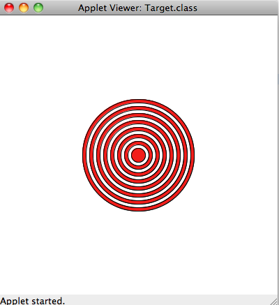
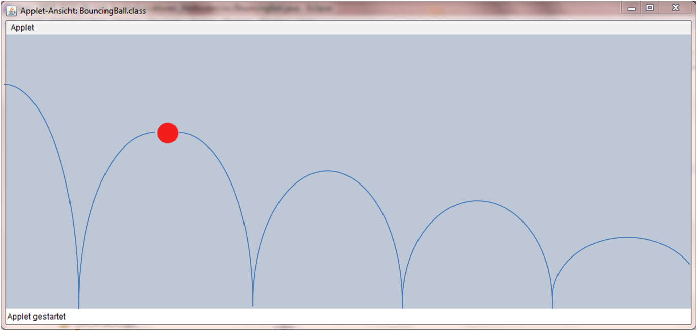
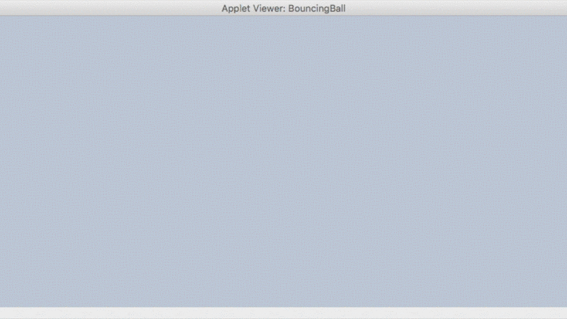

---
author:	Alexander Bazo
date: 11. September 2019
---

# Übungsblatt 4

## Wichtige Informationen zur Bearbeitung der Aufgabe 

 - [Informationen zur Entwicklungsumgebung *IntelliJ IDEA*](https://regensburger-forscher.de/oop/tutorials/Entwicklungsumgebung)
 - [Informationen zum Im- und Export von Projekten](https://regensburger-forscher.de/oop/tutorials/Starterprojekte)
 
## Starterpaket

Ein vorbereitetes Starterpaket zur selbständigen Implementierung der Aufgabe finden Sie [hier](https://github.com/OOP-Regensburg/GraphicsApp-Exercise-04/archive/Starterpaket.zip).

## **Refactoring durch Methoden**

**Klasse im Starterpaket:** `Target`

Im Starterprojekt für dieses Übungsblatt finden Sie eine Musterlösung
für das Target-Programm aus der letzten Übung. Bauen Sie den Code so um,
dass er leichter verständlich, modularer und besser wartbarer wird:

1.  Ergänzen Sie die Methode `getRingColor`, die eine Ganzzahl erwartet
    und eine Ringfarbe zurückgibt. Die zurückgegebene Ringfarbe ist
    davon abhängig, ob die übergebene Zahl gerade oder ungerade ist.

2.  Ergänzen Sie die Methode `drawRing`, die den Ring mit der
    übergebenen Farbe und dem übergebenen Radius zeichnet.

Passen Sie die `for`-Schleife innerhalb der `drawDartTarget`-Methode an,
indem Sie den vorhandenen Code durch die neu implementierten Methoden
ersetzen. Testen Sie, ob Ihr neu strukturiertes Programm immer noch
korrekt läuft.

## **Ball mit Physik**

**Klasse im Starterpaket:** `BouncingBall`

Erstellen Sie eine `GraphicsApp`, die einen Ball von links nach rechts
über die Zeichenfläche springen lässt:

Der Ball startet in der linken oberen Ecke, fällt dann zu Boden und
prallt wieder ab, solange er nicht den Bildschirm verlassen hat.

Auf den Ball wirken zwei Einflussfaktoren:

-   Die Schwerkraft *drückt* von oben auf den Ball und erhöht dessen
    Geschwindigkeit beim Herunterfallen in jedem Animationsschritt um
    einen konstanten Wert (z.B. 0.15). Beim Aufsteigen wird die
    Geschwindgkeit des Balles analog reduziert, bis der Ball bei der
    Geschwindgkeit '0' den Scheitelpunkt erreicht hat.

-   Bei jedem Aufprall gibt der Ball einen Teil seiner Energie ab. Legen
    Sie eine Konstante an, die angibt, wieviel Energie (= vertikale
    Geschwindigkeit) der Ball nach dem Aufprall auf den Boden noch
    behält (z.B. 0.9).

Die horizontale Geschwindigkeit des Balls ist während des gesamten
Programms konstant. Speichern Sie den Ball und seine Geschwindigkeit
(d.h. Positionsveränderung bei jedem Animationsschritt) in geeigneten
Instanzvariablen ab. Bei jedem Durchlauf von draw() sollte Ihr Programm
den Ball auf seine neue Position setzen und anschließend überprüfen, ob
der Ball auf den Boden geprallt ist. Wenn der Ball auf den Boden
getroffen ist, dann verändern Sie seine Geschwindigkeit.

**Achtung:** Es kann sein, dass der Ball ein gutes Stück unterhalb des
Bodens gesprungen ist, wenn Sie eine Kollision bemerken. Wenn dies der
Fall ist, müssen Sie ihn nach der Kollision wieder über den Boden
hieven. Dies können Sie mit dem folgenden Code erreichen:

`double diff = ball.getY() - (getHeight() - ball.getHeight());`\
`ball.move(0, -2 * diff);`

