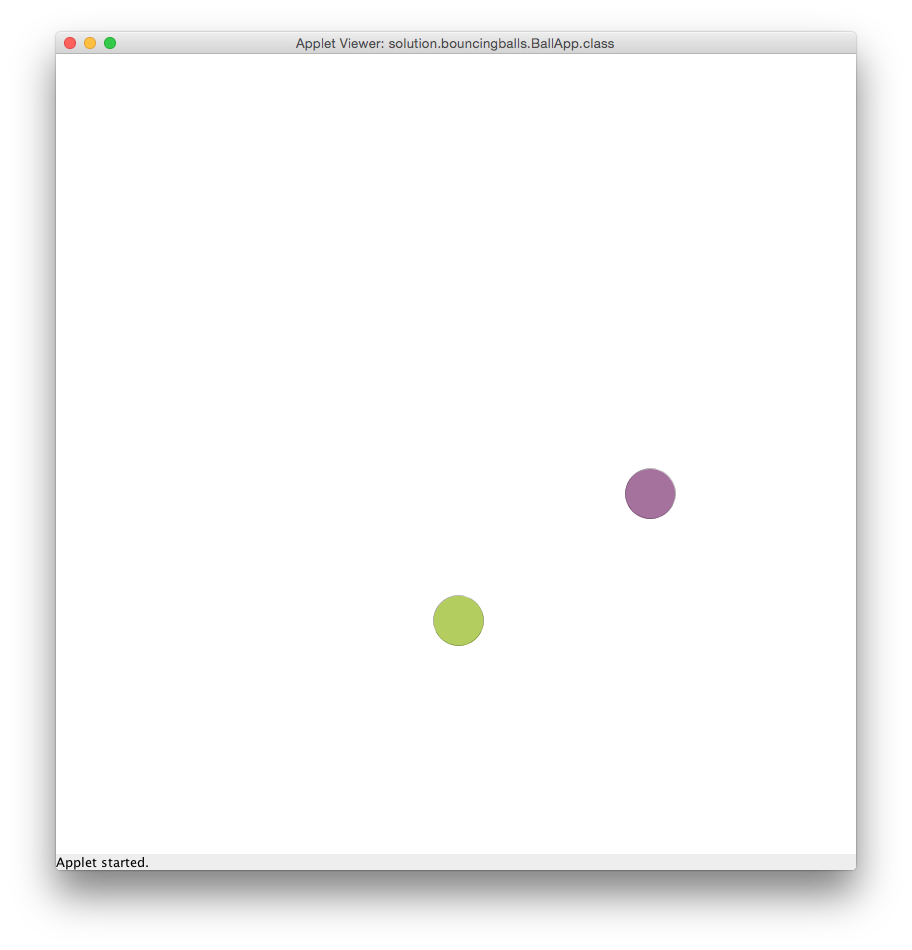

---
author:	Alexander Bazo
date: 11. September 2019
---


## Übung zur Einführung in die objektorientierte Programmierung mit Java

# Übungsblatt 5

### **Farbige Zufallskreise [gemeinsam bearbeiten]**

Entwickeln Sie eine `GraphicsApp`, die 100 farbige Kreise auf der
Zeichenfläche darstellt. Jeder der Kreise hat eine zufällige Farbe,
einen zufälligen Durchmesser zwischen 5 und 50 Pixeln und eine zufällige
Position auf der Zeichenfläche. Die Kreise müssen alle innerhalb der
Zeichenfläche dargestellt werden. Verwenden Sie die in der Vorlesung
vorgestellte Klasse `RandomGenerator` um alle Zufallswerte zu erzeugen.


Implementieren Sie eine eigene Methode pro zufälliger Eigenschaft der
Kreise und speichern Sie den Rückgabewert in einer lokalen Variable,
bevor Sie den Konstruktor der Klasse Ellipse aufrufen:

-   `private Color getNextColor()`

-   `private Point getNextPoint()`

-   `private int getNextDiameter()`

Verwenden Sie (wie immer) geeignete Konstanten, um unveränderliche Werte abzuspeichern.

### **Random Bouncing Balls [gemeinsam bearbeiten]**

In diesem Programm bewegen sich zwei Bälle über die Zeichenfläche und
prallen von den Wänden ab. Jeder Ball erhält zu Beginn eine zufällige
Geschwindigkeit und Größe sowie eine zufällige Farbe, die sich nach
jeder Kollision mit einer Wand zu einer anderen zufälligen Farbe ändert. Die Bälle selbst prallen nicht voneinander ab. Verwenden Sie die in der Vorlesung vorgestellte Klasse `RandomGenerator` um alle Zufallswerte zu
erzeugen.



**Vorgehen**

Erstellen Sie eine eigene Klasse `RandomBall`, die über die folgenden
Instanzvariablen verfügt:

-   Ein Objekt der Klasse `Ellipse` zum Zeichnen des Balls.

-   Ein Objekt der Klasse `RandomGenerator`.

-   Variablen (primitive Datentypen) für die Geschwindigkeit in x und y
    Richtung - diese werden bei Objekterzeugung auf Zufallswerte
    gesetzt. Die obere und untere Grenze für diese Werte werden dem
    Konstruktor der Klasse übergeben.

Zusätzlich verfügt die Klasse über zwei Konstanten, die für die
zufällige Auswahl der Größe (bei der Initialisierung) des Balls genutzt
werden sollen:

```
private static final int MIN_DIAMETER = 50;
private static final int MAX_DIAMETER = 100;
```

Die Klasse `RandomBall` benötigt die folgenden `public`-Methoden:

-   Einen Konstruktor mit Parametern für die Breite und Höhe der
    Zeichenfläche sowie der oberen und unteren Grenze zur Bestimmung
    der zufälligen Geschwindigkeit. Im Konstruktor wird der
    Zufallsgenerator angelegt um damit die Größe, Farbe und
    Geschwindigkeit des Balls zu bestimmen und ihn an einer zufälligen
    Position zu platzieren.

-   `update` - ändert die Position des `RandomBall` auf der Basis der
    aktuellen Geschwindigkeit

-   `draw` - zeichnet den `RandomBall`

-   `checkWallCollision(int canvasWidth, int canvasHeight)` - überprüft
    ob der Ball mit einer der Wände der Zeichenfläche (bestimmt über die
    Parameter) kollidiert. Berührt der Ball eine der Wände, so werden
    entsprechend Bewegungsrichung (siehe Vorlesungsbeispiel:
    BouncingBall) und Farbe angepasst.

Beachten Sie bitte, dass Sie wahrscheinlich weitere `private`-Methoden
innerhalb der Klasse anlegen müssen, um Ihren Code übersichtlich zu
gestalten.

Zusätzlich zur Klasse `RandomBall` müssen Sie die vorgegebene Klasse
`BallApp` fertig implementieren. In dieser sollen Sie die beiden Objekte der Klasse `RandomBall` erzeugen und die Kollision mit den Seitenwänden überprüfen. Initialisieren Sie die Zeichenfläche und die Bälle in der `setup`-Methode.\
 (*Decomposition*: Lagern Sie die Teilbereiche der Initialisierung in einzelne Methoden aus, die dann in `setup` aufgerufen werden) 

In der `draw`-Methode werden bei jedem Aufruf der Hintergrund
neu gezeichnet und die beiden Bälle aktualisiert und neu gezeichnet.
Rufen Sie dafür die Methoden zur Kollisionsabfrage, zum *updaten* und
zum Zeichnen in einer sinnvollen Reihenfolge für beide Objekte auf.

### **Java Wars [vorbereiten]**

Arbeiten Sie dieses Programm ohne Computer durch und geben Sie an,
welche Ausgaben das Programm erzeugt.

``` {.java}
import acm.program.*;       // For ConsoleProgram
import de.ur.mi.graphics.*; // For Point and Ellipse

public class JavaWars extends ConsoleProgram {

    public void run() {
        String hanSolo = "I've got...";
        Point alderaan = new Point(2.718, 3.141);
        int r2d2 = 137;
        
        Ellipse emperor = new Ellipse(45, 70, 10, 20, Color.BLACK);
        lukeSkywalker(emperor, alderaan);
        println("emperor.getX() = " + emperor.getX());
        println("alderaan.getX() = " + alderaan.getX());
        darthVader(emperor, r2d2);
        println("emperor.getY() = " + emperor.getY());
        println("r2d2 = " + r2d2);
        alderaan = landoCalrissian(alderaan, hanSolo);
        println("hanSolo = " + hanSolo);
        println("alderaan.getX() = " + alderaan.getX());
    }

    private void lukeSkywalker(Ellipse chewbacca, Point toto) {
        chewbacca.setPosition(40, 66);
        toto = new Point(1.61, 98.6);
    }

    private Ellipse darthVader(Ellipse emperor, int r2d2) {
        emperor = new Ellipse(90, 100, 10, 20, Color.BLACK);
        r2d2 = 14;
        return emperor;
    }

    private Point landoCalrissian(Point alderaan, String hanSolo) {
        hanSolo = hanSolo + "... a very bad feeling about this.";
        alderaan = new Point(99.9, 44.4);
        return alderaan;
    }
}
```

----

**Hinweis:** Übungsaufgaben und Konzept basieren zum Teil auf dem Kurs
*CS106A: Programming Methodology* der Universität Stanford von Eric
Roberts und Mehran Sahami