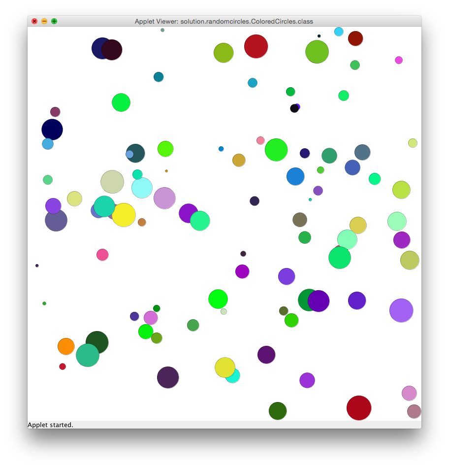
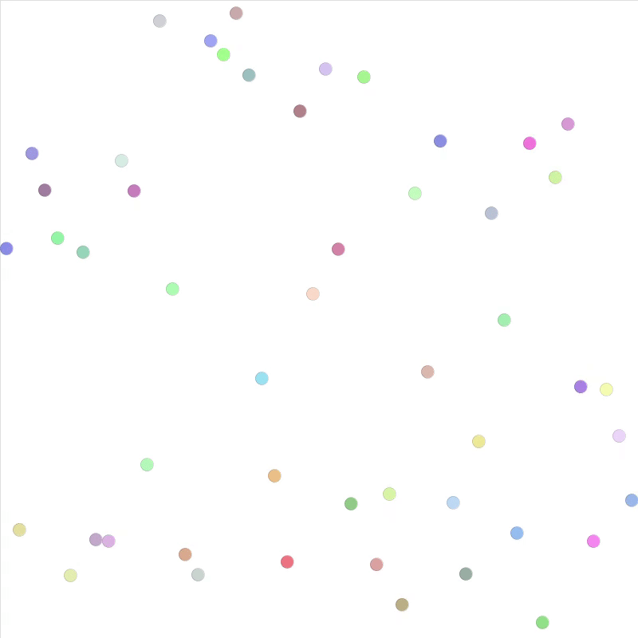

---
author:	Alexander Bazo
date: 11. September 2019
---

# Übungsblatt 5

## Wichtige Informationen zur Bearbeitung der Aufgabe 

 - [Informationen zur Entwicklungsumgebung *IntelliJ IDEA*](https://regensburger-forscher.de/oop/tutorials/Entwicklungsumgebung)
 - [Informationen zum Im- und Export von Projekten](https://regensburger-forscher.de/oop/tutorials/Starterprojekte)

## Starterpaket

Ein vorbereitetes Starterpaket zur selbständigen Implementierung der Aufgabe finden Sie [hier](https://github.com/OOP-Regensburg/GraphicsApp-Exercise-05/archive/Starterpaket.zip).

## **Farbige Zufallskreise**

Entwickeln Sie eine `GraphicsApp`, die 100 farbige Kreise auf der
Zeichenfläche darstellt. Jeder der Kreise hat eine zufällige Farbe,
einen zufälligen Durchmesser zwischen 5 und 50 Pixeln und eine zufällige
Position auf der Zeichenfläche. Die Kreise müssen alle innerhalb der
Zeichenfläche dargestellt werden. Verwenden Sie die in der Vorlesung
vorgestellte Klasse `Random` um alle Zufallswerte zu erzeugen.

Implementieren Sie eine eigene Methode pro zufälliger Eigenschaft der
Kreise und speichern Sie den Rückgabewert in einer lokalen Variable,
bevor Sie den Konstruktor der Klasse Ellipse aufrufen:

-   `private Color getNextColor()`

-   `private Point getNextPoint()`

-   `private int getNextDiameter()`

Verwenden Sie (wie immer) geeignete Konstanten, um unveränderliche Werte abzuspeichern.

## **Circle Rain, Circle Rain**

In dieser Aufgabe geht es darum, mit zwei Arrays die Animation von einer beliebigen Anzahl an Kreisen zu verwalten. Über eine Konstanten soll festgelegt werden, wieviele Kreise gezeichnet werden. Entsprechend sollen weitere Konstanten bestimmen, wie breit ein Kreis ist, so dass alle nebeneinander auf die Zeichenfläche passen.

Alle Kreise haben eine Startposition am oberen Bildschirmrand. Zu Beginn des Programms sollen jeweils ein Array mit den Kreisen und ein Array mit Geschwindigkeiten angelegt werden. Beide Arrays sollen die gleiche Größe haben. Die Geschwindigkeiten und die Farbe der Kreise sind zufällig zu wählen.

In der `draw()`-Schleife sollen nun alle Kreise mit der ihnen entsprechenden Geschwindigkeit vertikal nach unten bewegt werden. Stößt ein Kreis am unteren Rand an, so ist seine Position so anzupassen, dass er wieder am oberen Bildschirmrand startet.

In der folgenden GIF-Animation ist das Ergebnis zu sehen:

