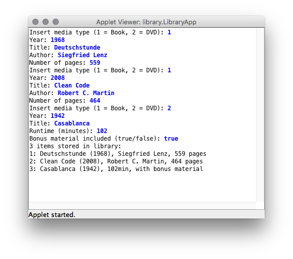
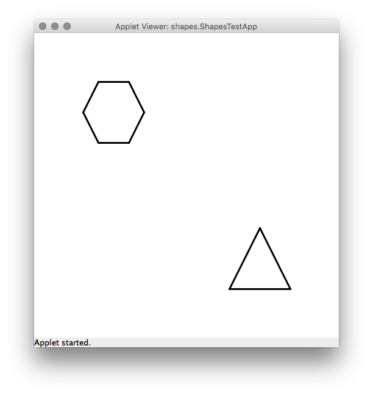

---
author:	Alexander Bazo
date: 11. September 2019
---

## Übung zur Einführung in die objektorientierte Programmierung mit Java

# Übungsblatt 6

### **Eine Bibliotheks-App [gemeinsam bearbeiten]**

Entwerfen Sie in dieser Aufgabe eine Klassenstruktur, die die Verwaltung
von Medien in einem Bibliothekskatalog abbildet. Der Katalog soll Bücher
und DVDs enthalten können; eine zusätzliche `ConsoleApp` nutzt die
implementierten Klassen um Medien durch den Benutzer einlesen zu
lassen.

Im ersten Teil der Anwendung werden die nötigen Klassen für die
Mediensammlung entworfen:

-   Die Klasse `Media` stellt die Grundstruktur für alle anderen
    Medientypen dar. Eine Klassenvariable (`static`) speichert die
    Anzahl bereits erstellter `Media`-Instanzen und wird im Konstruktor
    entsprechend bei jedem Aufruf inkrementiert. In nicht-öffentlichen
    Instanzvariablen werden eine fortlaufende, numerische ID sowie das
    Erscheinungsjahr und der Titel des Mediums mit passenden Datentypen
    abgebildet. Initiale Werte für diese Eigenschaften werden dem
    Konstruktor übergeben.

    Die gespeicherten Werte können über `getter`-Methoden ausgelesen
    werden. Überschreiben Sie die implizit von `Object` geerbte Methode
    `toString`. Diese soll einen verketteten Text zurückgeben, der
    sowohl die ID als auch den Titel und das Erscheinungsjahr des
    jeweiligen Mediums zurück gibt.

-   Die Klasse `Book` erbt von `Media` und erweitert diese um jeweils
    eine Eigenschaft für den Autoren und die Anzahl der Seiten.
    Verwenden Sie geeignete Instanzvariablen und sorgen Sie dafür, dass
    deren Inhalt über `getter`-Methoden ausgelesen werden kann. Die
    initialen Werte sollen wieder über den Konstruktor übergeben werden.
    Achten Sie beim Implementieren des Konstruktors darauf, dass auch
    die ursprünglichen `Media`-Eigenschaften (Titel und Jahr) als
    Parameter übergeben werden, und dass der eigentliche Konstruktor der
    *Elternklasse* mit diesen Werten aufgerufen wird. Überschreiben Sie
    die `toString`-Methode so, dass auch die zusätzlichen Eigenschaften
    im zurückgegebenen String enthalten sind.

-   Die Klasse `DVD` erbt ebenfalls von `Media`. Implementieren Sie
    diese genau wie `Book`. Anstatt Autorenname und Seitenzahl werden
    hier jedoch die zusätzlichen Eigenschaften Laufzeit (in Minuten) und die Information, ob Bonusmaterial auf der DVD vorhanden ist
    abgebildet.

Im zweiten Teil der Aufgabe wird eine `LibraryApp` erstellt. Erweitern
Sie dazu die vorgegeben Datei im Starterpaket. Das Programm soll dabei
folgende Aufgaben erfüllen:

-   In einem Array vom Typ `Media` werden drei Medien gespeichert.

-   Der Benutzer wird für jede Stelle des Arrays aufgefordert, die Daten
    eines neuen Medium einzugeben. Dabei kann er über eine numerische
    Eingabe auswählen, ob ein Buch oder eine DVD gespeichert werden
    soll.

-   Je nach Auswahl des Nutzers werden anschließend die nötigen
    Informationen über die Konsole eingelesen. Mit den Eingaben wird ein
    entsprechende Objekt vom Typ `Book` oder `DVD` erstellt und im Array
    gespeichert.

-   Nach Eingabe aller Medien wird eine Liste mit dem Inhalt der
    Bibliothek ausgegeben. Iterieren Sie hierzu über das komplette Array
    und rufen Sie für jedes gespeicherte Objekt dessen
    `toString`-Methode auf. Die Rückgabe der Methode wird auf der
    Konsole ausgegeben.

### **Neue Shapes für die GraphicsApp [gemeinsam bearbeiten]**

Erweitern Sie die Funktionalität der `GraphicsApp` um zwei neue Formen:
Ein gleichschenkliges Dreieck (`Triangle`) sowie ein
Achsen-symmetrisches Sechseck (`Hexagon`). Beide Formen werden durch
entsprechende Java-Klassen abgebildet, die von `GraphicsObject` erben.
Die Darstellung erfolgt in der überschriebenen `draw`-Methode durch
Zeichnen der Umrisslinien. Das Innere der Formen muss nicht eingefärbt
bzw. dargestellt werden. Testen Sie anschließend Ihre Anwendung, in dem
Sie die auskommentierten Zeilen der `ShapesTestApp` durch Entfernen der
Kommentare nutzbar machen und die Anwendung ausführen. Haben Sie die
Klassen korrekt implementiert, sollten Sie die neuen Formen auf dem
Bildschirm sehen. Das Sechseck bewegt sich nach oben links, das Dreieck
nach unten rechts.

**Hinweise:** Speichern Sie in den Klassen die jeweiligen Eckpunkte und
zeichnen Sie beim Aufruf von `draw` die Verbindungslinien zwischen
diesen Punkten. Die Klassen `GraphicsObject` verfügt über Variablen und
Methoden zur Abbildung eines Koordinatenpaars (x und y). Nutzen Sie
diesen Punkt als Zentrum bzw. Schwerpunkt für Ihre neuen Formen und
berechnen Sie die anderen Punkte auf dieser Basis. Denken Sie daran,
dass die verschiedenen Methoden des `GraphicsObject` die x- und
y-Koordinaten beeinflussen und Sie die Eckpunkte Ihrer Form regelmäßig
(z.B. vor jedem Zeichnen) neu berechnen müssen.

