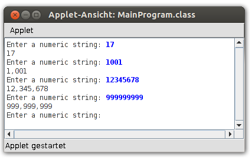
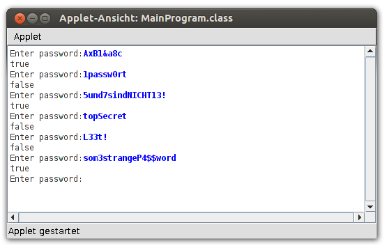
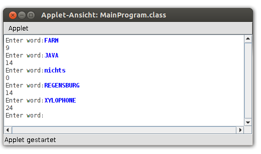

---
author:	Alexander Bazo
date: 11. September 2019
---

## Übung zur Einführung in die objektorientierte Programmierung mit Java

# Übungsblatt 8

**Hinweis:** Erstellen Sie für jede der Aufgaben ein sinnvoll benanntes
`package` im `src`-Ordner des Starterpakets. Nutzen Sie das
*ConsoleProgramm* `MainApp` um die verschiedenen Klassen des
Übungsblatts zu instanziieren und zu testen.

### **Delete Character [vorbereiten]**

Schreiben Sie eine Klasse `Remover `mit einer statischen Methode

`public static String removeOccurrences``(String str, char ch)`

die alle Zeichen `ch `aus `str `löscht und das Ergebnis wie folgend
zurückgibt:

`Remover.removeOccurrences("’This is a test"’, ’t’)` **gibt zurück:**

`"’This is a es"’`\

`Remover.removeOccurrences("’Summer is here"’, ’e’)` **gibt zurück:**

`"’Summr is hr"’`\

`Remover.removeOccurrences("’—0—"’, ’-’)` **gibt zurück:**
 
 `"’0"’`

Beachten Sie, dass Sie kein Objekt einer Klasse erstellen müssen, wenn
Sie lediglich statische Methoden (wie in diesem Fall) nutzen.

### **NumberDelimiter [vorbereiten]**

Beim Schreiben von besonders großen Zahlen ist es üblich, ein
Tausender-Trennzeichen zu benutzen, um die Ziffernfolge in Dreiergruppen zu unterteilen. Dieses Trennzeichen kann ein Leerzeichen, ein Komma oder
ein Punkt sein.

Eine Million würde zum Beispiel folgendermaßen geschrieben:

1,000,000\
1.000.000\
1 000 000

Um die Darstellung solcher Zahlen zu vereinfachen, sollen Sie nun eine
Klasse `CommaGenerator ` implementieren, welche ein bei der Objekterstellung
übergebenes Trennzeichen als Instanzvariable abspeichert, auf die bei
der Verarbeitung der Ziffernfolgen zugegriffen wird. Die erlaubten
Trennzeichen sollen die oben genutzten sein (Komma, Punkt, Leerzeichen).
Benutzen Sie hierzu folgenden Klassenrumpf:

    public class CommaGenerator{

        public static final int SEPARATOR_COMMA = 0;
        public static final int SEPARATOR_POINT = 1;
        public static final int SEPARATOR_SPACE = 2;
        
        private char separator;

        // Konstruktor und Methoden hier implementieren

    }

Achtung: Nutzen Sie bei Objekterzeugung die statischen Variablen (vgl.
Enumeration-Prinzip) der Klasse `CommaGenerator ` oder nutzen Sie den
Enum-Datentyp (vgl. Vorlesung) und übergeben Sie diese dem Konstruktor, z.B. so:

    CommaGenerator commaGenerator = new CommaGenerator(CommaGenerator.SEPARATOR_SPACE);

Im Konstruktor lesen Sie den übergebenen Wert und setzen das
Trennzeichen für das Objekt entsprechend des Parameters. Wird kein
gültiges Trennzeichen übergeben, soll das Komma verwendet werden. Ein
Objekt dieser Klasse soll nun also mit der Methode

`public String addSeparatorToNumericString``(String digits)`

einen übergebenen Text aus Zahlen mit Trennzeichen an jeder dritten
Position von rechts zurückgeben.
Ein ConsoleProgram mit folgendem Code ...

    public void run() {
        CommaGenerator commaGenerator = new CommaGenerator(CommaGenerator.SEPARATOR_COMMA);
        while (true) {
            String digits = readLine("Enter a numeric string: ");
            if (digits.length() == 0) {
                break;
            }
            String result = commaGenerator.addSeperatorToNumericString(digits);
            println(result);
        }
    }

sollte also folgendes Ergebnis liefern:

### **Password Checker [gemeinsam bearbeiten]**

Gute Passwörter sollten so aufgebaut sein, dass sie nicht leicht durch
massives Ausprobieren aufgrund von Wörterbüchern und Zahlenfolgen
erraten werden können.

Schreiben Sie eine Klasse `PasswordChecker `mit einer statischen Methode

`public static boolean isStrongPassword``(String str)`

welche die Zeichen eines übergebenen Strings überprüft und nur dann
`true `zurückgibt, wenn alle folgenden Bedingungen erfüllt sind.\
Das Passwort besteht aus\...

-   \...mindestens 8 Zeichen,

-   mindestens zwei Buchstaben,

-   mindestens zwei Ziffern,

-   mindestens einem Groß- und einem Kleinbuchstaben,

-   mindestens einem Sonderzeichen.

(als Sonderzeichen gelten alle Zeichen außer Zahlen und Buchstaben, vgl.
dazu die statischen Methoden der Klasse `Character`)

Der PasswordChecker soll folgende Ergebnisse liefern:

### **Scrabble Score [optional]**

In Scrabble ist jedem Buchstaben eine Punktzahl zugeordnet, die von
seiner Häufigkeit in der entsprechenden Sprache abhängt.

Für die englische Version gelten die folgenden Punktzahlen:

  
| **Punkte** |          **Buchstaben**            |
| --- | --- |
| 1 |             A, E, I, L, N, O, R, S, T, U    | 
| 2  |                        D, G                |
| 3  |                     B, C, M, P             | 
| 4    |                 F, H, V, W, Y            | 
| 5   |                        K                  | 
| 8   |                       J, X                |  
| 10    |                     Q, Z                | 

Das Wort **FARM** ist folglich 9 Punkte wert: 4 für das F, jeweils einen für A und R und 3 für das M.

Schreiben Sie eine Klasse `ScrabbleScoreChecker `mit einer statischen
Methode

`public static int getWordScore``(String str)`

welche die Punkte für ein übergebenes Wort zurückgibt. Um zu überprüfen, wie viele Punkte ein einzelner `char `bringt, können
Sie die einzelnen Buchstaben in jeweils einem String pro Gruppe
abspeichern (z.B.: `private final String onePointChars =
"AEILNORSTU"`) und mit der `indexOf()`-Methode der
`String`-Klasse überprüfen, an welcher Stelle ein bestimmter `char`
darin vorkommt (gibt -1 zurück, falls er nicht darin vorkommt). Ihr
Programm soll am Ende folgende Ausgabe produzieren können:

----

**Hinweis:** Übungsaufgaben und Konzept basieren zum Teil auf dem Kurs
*CS106A: Programming Methodology* der Universität Stanford von Eric
Roberts und Mehran Sahami
