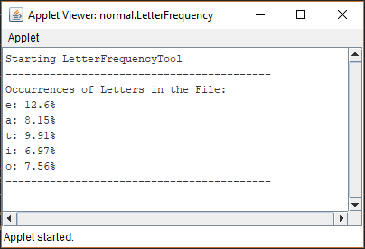

---
author:	Alexander Bazo
date: 11. September 2019
---

## Übung zur Einführung in die objektorientierte Programmierung mit Java

# Übungsblatt 11

### **Heap/Stack Diagram [vorbereiten]**

Visualisieren Sie den Zustand des Heaps und Stacks anhand eines
Heap/Stack-Diagramms an der im Code vermerkten Stelle (siehe Kommentar).
Markieren Sie auch die Werte, die zu dem Zeitpunkt vom Garbage Collector geholt werden. Den Code der Klasse `Rational` finden Sie im darauf folgenden Listing.

    public void run(){
        Rational r = new Rational(1,2);
        r = raiseToPower(r,3);
        println("r ^ 3 = "+r);
    }

    public Rational raiseToPower(Rational x, int n){
        Rational result = new Rational(1);
        for(int i=0; i<n; i++){
            result = result.multiply(x);
        }
        return result; // Diagramm hier !
    }

Rational ist folgende Bruch-Klasse:

    public class Rational{
        
        private int num;
        private int den;
        
        public Rational(){
            this(0);
        }   
        
        public Rational(int n){
            this(n,1);
        }
        
        public Rational(int x, int y){
            int g = gcd(Math.abs(x), Math.abs(y));
            num = x / g;
            den = Math.abs(y) / g;
            if(y<0) num = -num;
        }
        
        public Rational multiply(Rational r){
            return new Rational(num * r.num, den * r.den);
        }
        
        public String toString(){
            if(den == 1){
                return ""+num;
            }else{
                return num+"/"+den;
            }
        }
        
        private int gcd(int x, int y){
            int r = x%y;
            while(r!=0){
                x = y;
                y = r;
                r = x%y;
            }
            return y;
        }
        
    }

### **Letter Frequency [gemeinsam bearbeiten]**

In Spielen wie Hangman ist es sinnvoll, beim Erraten zuerst Buchstaben
zu verwenden, die in einer Sprache besonders häufig vorkommen.

Laut Wikipedia (<http://en.wikipedia.org/wiki/Letter_frequency>) sind
die häufigsten Buchstaben in gedruckten englischen Texten: *e* (12,7%), *a* (8,16%), *t* (9,06%), *i* (6,97%) und *o* (7,5%). Demnach sind
beispielsweise 12,7% aller englischen Buchstaben in gedruckten Texten
ein *e*.

Ihr Programm soll anhand der englischen Version des Textes *Alice's
Adventures in Wonderland* von Lewis Carroll untersuchen, ob die
Ergebnisse der in Wikipedia zitierten Untersuchung auch auf kleinere
Textbestände zutreffen. Berücksichtigen Sie nur die fünf häufigsten
Buchstaben.

Schreiben Sie dazu ein Programm (Benutzen Sie das vorgegebene
Starterpaket und legen Sie alle noch notwendigen Klassen selbst an),
welches den vorgegebenen Text (`/data/assets/alice_wonderland.txt`) zeilenweise einliest und die Buchstaben des Textes zählt. Geben Sie am Ende die relative Häufigkeit (d.h. Anteil der Buchstaben an der Gesamtzahl aller Buchstaben im Text) der einzelnen fünf Buchstaben auf der Konsole aus (hierzu müssen Sie natürlich auch die Gesamtanzahl an Buchstaben im Text zählen).

**Entwerfen Sie geeignete Klassen für diese Aufgabe!** Das Ergebnis soll
folgendermaßen aussehen:

**Hinweis:** Nutzen Sie zum Laden der Datei die statische Methode
`loadFile` der `GraphicsApp`-Klasse.

Die Kommunikation zwischen der ConsoleProgram-Unterklasse
*LetterFrequency* und der selbst erstellten Klasse zur Verarbeitung des
Texts soll bei dieser Aufgabe nicht über Rückgabewerte, sondern über ein
*Observer Pattern* realisiert werden (vgl. Vorlesung zu Events und
Interfaces, S. 10). Nutzen Sie hierfür das vorgegebene Interface
*OnTextAnalysisListener*, indem Sie:

-   Das Interface in *LetterFrequency* implementieren.

-   Bei der Initialisierung ihrer Klasse zur Zählung der Buchstaben die
    aktuelle Instanz von *LetterFrequency* als Objekt vom Typ
    *OnTextAnalysisListener* übergeben und in einer geeigneten Variable
    speichern (d.h. als Observer registrieren)

-   In Ihrer selbst erstellten Klasse nach abgeschlossener Analyse des
    Textes den registrierten Observer durch Nutzung der durch das
    Interface *OnTextAnalysisListener* vorgegebenen Methode
    *onLettersCounted(String resultString)* über den Abschluss des
    Vorgangs und das Ergebnis informieren.

**Hinweis:** Da Sie hier keine echte Parallelität implementieren, bietet dieses Vorgehen genau genommen keinen wirklichen Vorteil im Vergleich zur bekannten Nutzung von Rückgabewerten. Dieses Vorgehen dient hier in erster Linie dazu, Sie mit dem grundlegenden Aufbau eines solchen Ansatzes vertraut zu machen.

----

**Hinweis:** Übungsaufgaben und Konzept basieren zum Teil auf dem Kurs
*CS106A: Programming Methodology* der Universität Stanford von Eric
Roberts und Mehran Sahami
