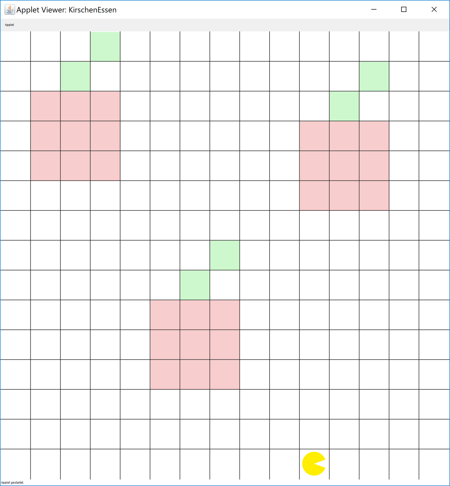

---
author:	Florin Schwappach
date: 11. September 2019
---

## Übung zur Einführung in die objektorientierte Programmierung mit Java

# Übungsblatt 2.5

Bevor Sie mit den Übungsaufgaben beginnen können, müssen Sie zuerst das
enstprechende Starterpaket
(`OOP_17WS_U02.5_KirschenEssen_und_BunteSchleifen-Starter.zip`)
importieren.

### **Kirschen essen mit Bouncer**

In dieser Aufgabe liegen in Bouncers Welt einige Kirschen, die Bouncer
sich vorknöpfen möchte. Schreiben Sie ein Programm, mit dem Sie jede
Zelle der Karte auf Kirscheninhalte überprüfen und gegebenenfalls weiss
färben (= essen). Sie müssen eine Lösung programmieren, die für Karten
mit beliebig verteilten Kirschen funktioniert. Achten Sie darauf, nicht
den Stiel mit zu essen, das bekommt Bouncer nicht gut.

Die Aufgabe besteht darin, die Kommandos für Bouncer zu schreiben, um
die folgenden Teilaufgaben zu lösen.

1.  Ablaufen der Zeilen/Spalten

2.  Detektion und Essen der Kirschenfelder

**Hinweise:** Schreiben Sie eine eigene `private`-Methode für jeden der
oben dargestellten Schritte. Teilen Sie die identifizierten Teilprobleme
auf weitere Methoden auf. Beachten Sie dabei die, in der Vorlesung
angesprochenen Verfahren des Top-Down-Ansatzes sowie der Decomposition.
Achten Sie darauf, sowohl den Code als auch die Kommentare (z.B. *pre*-
und *post-conditions*) in Englisch zu schreiben. Verwenden Sie
aussagekräftige Bezeichnungen für Ihre eigenen Methoden.

### **GraphicsApp: Bunte Schleifen**

**Vorab**: Diese Aufgabe umfasst einige Konzepte, die in der Vorlesung
nur am Rande oder gar nicht behandelt wurden. Sie ist zum Tüfteln
gedacht.

In dieser Aufgabe geht es darum, ein bisschen mit der GraphicsApp zu
experimentieren. Das Ziel ist es, ein Muster zu erzeugen, dass dem
abgebildeten ähnelt. Es ist nicht unbedingt notwendig, dass eine exakte
Entsprechung vorliegt. Wichtig ist, dass die im Folgenden beschriebenen
Kernelemente vorhanden sind.

Zeichnen Sie Ellipsen, die im Kreis angeordnet sind. Hierzu ist eine
besondere `for`-Schleife gegeben: Diese zählt nicht, wie gewohnt, einen
`int`-Wert hoch. Es wird stattdessen ein `double`-Wert verwendet, der
Bruchteile hochzählt.

`for (double j = 0; j < 2*Math.PI; j += Math.PI/12.0) {...}`

Das ist für die gegebene Aufgabe einfach praktisch: Um Dinge im Kreis
anzuordnen, benötigen wir Sinus (X-Koordinate) und Kosinus
(Y-Koordinate). Die Parameter dafür lassen wir uns gleich durch die
Zählvariable berechnen: Wir zählen anteilig hoch, bis `2 * Math.PI`
erreicht ist - der Umfang eines Kreises in Bogenmaß. Im gegebenen
Beispiel sind es 12 Positionen auf dem Kreis, die sich so ergeben.

Um das Ganze etwas schöner zu gestalten, kann man die Position der
Kreise in der Mitte verankern, und davon ausgehend `Math.sin(j)` und
`Math.cos(j)` hinzuaddieren. Nun wissen wir auch noch, dass Sinus und
Kosinus einen Wertebereich von -1 bis 1 haben. Drum müssen die Werte
noch etwas skaliert werden, damit man einen Unterschied sieht, der
Canvas ist ja mehrere Hundert Pixel groß.

Abschließend sollen Sie die im Kreis gezeichneten Ellipsen schachteln,
wie auf dem Bild gezeigt. Dazu müssen Sie noch eine `for`-Schleife um die
Kreis-Berechnungsschleife bauen.

**Hinweise:** Färben Sie die Kreise wenn Sie möchten, um ein wenig Farbe
in das Einheitsgrau zu bringen. Um einer Ellipse eine besondere Farbe zu
geben, nutzen Sie den Aufruf `new Color(Rotwert, Grünwert, Blauwert)`
als Argument. Die übergebenen Werte sind Zahlen von 0-255. Damit Sie
einen ähnlichen Farbverlauf wie im Bild dargestellt erhalten, müssen Sie
einzelne Farbwerte abhängig von der Schleifen-Zählvariable verändern.

Für die Darstellung der Kreise nutzen Sie die Klasse `Ellipse` der
*GraphicsApp*-Umgebung. Über die Nutzung und Konfiguration der
Komponenten können Sie sich in der Dokumentation informieren:
<http://uniregensburg.github.io/ProcessingOO/docs/> . Wie die Anwendung
am Ende aussehen soll, können Sie dem Screenshot entnehmen.

----

**Hinweis:** Übungsaufgaben und Konzept basieren zum Teil auf dem Kurs
*CS106A: Programming Methodology* der Universität Stanford von Eric
Roberts und Mehran Sahami
