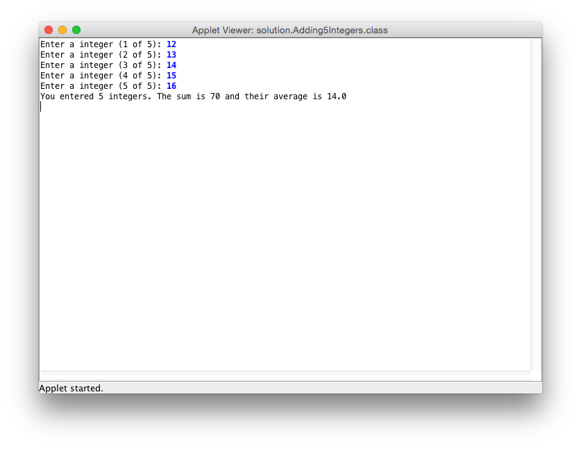
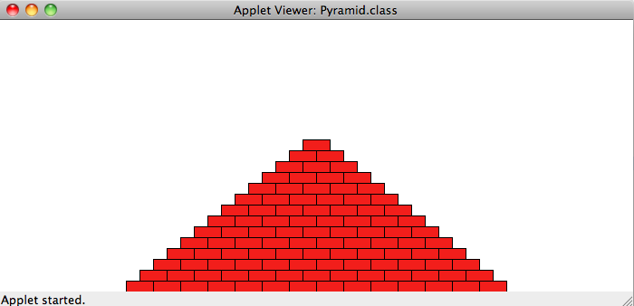
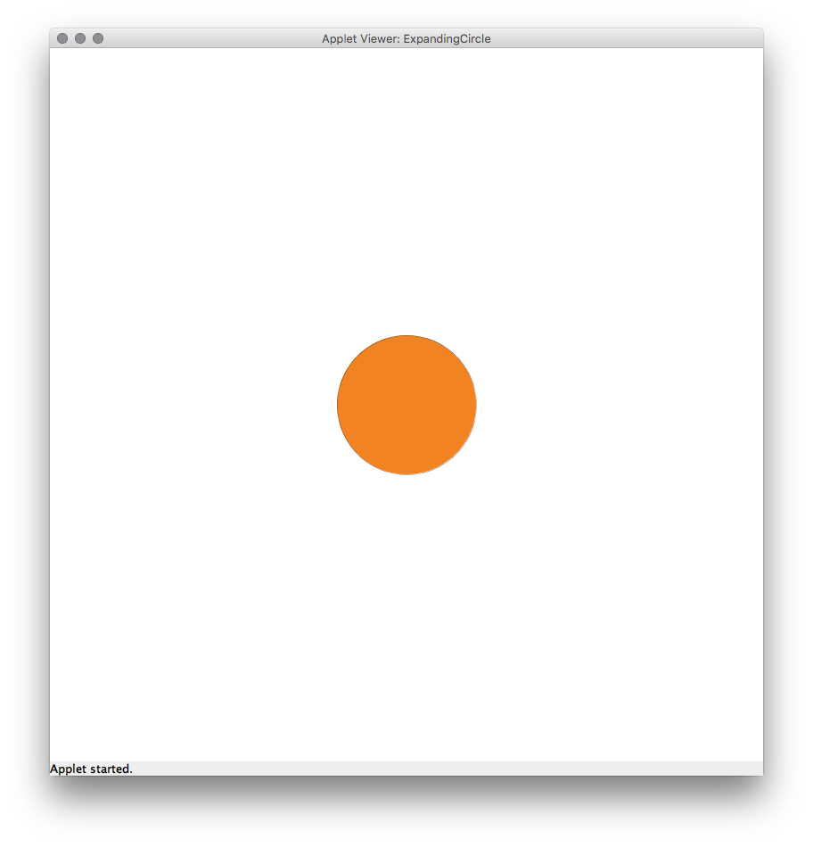

---
author:	Alexander Bazo
date: 11. September 2019
---


## Übung zur Einführung in die objektorientierte Programmierung mit Java

# Übungsblatt 4

### **Summe und Durchschnitt [wird gemeinsam bearbeitet]**

**Klasse im Starterpaket:** `Adding5Integers`

In dieser Aufgabe sollen Sie das Vorlesungsbeispiel aus der letzten
Woche (*Add2Integers*) erweitern. Ihr Programm soll fünf Integer-Werte
vom Nutzer einlesen und Summe sowie den Durchschnitt berechnen. Für die
Speicherung der eingegebenen Werte verwenden Sie ein Array vom Typen
`int` und der Länge 5.



Legen Sie in Ihrem Programm eine Konstante an, die die maximale Anzahl
an einzugebenende Zahlen definiert. Auf Klassenebene deklarieren Sie das
Array und initialisieren es in der `run`-Methode mit der durch die
Konstante festgelegten Länge. Die weitere Ausführung des Programms
lagern Sie in drei Teilmethoden aus:

-   Implementieren Sie eine Methode, die Zahlen (wie viele wird über die
    Konstante bzw. die Länge des Arrays bestimmt) in das Array einliest.
    Dabei wird jede Stelle des Arrays nacheinander gefüllt und die
    Methode endet, wenn der Nutzer die letze Zahl eingegeben hat.

-   Schreiben Sie eine Methode, die das Array als Parameter übergeben
    bekommt und aus den darin gespeicherten Zahlen die Gesamtsumme
    berechnet und zurückgibt.

-   Schreiben Sie eine letzte Methode, die das Array als Parameter
    übergeben bekommt und den Durchschnitt (`double`-Typ verwenden) der
    gespeicherten Zahlen berechnet. Die Methode soll den berechneten
    Wert anschließend als Gleitkommazahl zurückgeben. **Tipp**: Für den
    Durchschnitt benötigen Sie die Summe der Zahlen, denken Sie daran,
    dass Sie die Teilaufgabe des Summierens bereits gelöst haben.

Rufen Sie die implementierten Methoden in der richtigen Reihenfolge auf,
speichern Sie die jeweiligen Rückgabewerte und geben Sie Summe und
Durchschnitt auf der Konsole aus.

### **Pyramide [gemeinsam bearbeiten]**

**Klasse im Starterpaket:** `Pyramid`

Ihr Programm soll eine Pyramide zeichnen, die aus einzelnen Ziegeln
besteht, die in horizontalen Linien angeordnet werden. Die Anzahl der
einzelnen Blöcke nimmt um einen Block pro Reihe ab:



Die Pyramide soll am unteren Ende der Zeichenfläche stehen und in der
Mitte zentriert werden. Verwenden Sie mindestens die folgenden
Konstanten:

`BRICK_WIDTH` für die Breite der Ziegel (30).\
`BRICK_HEIGHT` für die Höhe der Ziegel (12).\
`BRICKS_IN_BASE` für die Anzahl der Ziegel der untersten Reihe (14).

Die angegebenen Zahlen entsprechen der Pyramide auf dem Screenshot, aber Ihre Pyramide muss für unterschiedliche Werte korrekt funktionieren.

**Tipp zur Herangehensweise:** Versuchen Sie zuerst, einen Stapel aus
einzelnen Ziegeln zu erzeugen. Modifizieren Sie diesen Code dann, um
eine Wand zu erzeugen (und denken Sie an das *Decompositing*).
Anschließend modifizieren Sie diesen Code, so dass in jeder Reihe ein
Ziegel mehr bzw. weniger gesetzt wird (je nachdem, ob Sie die Pyramide
von oben oder von unten bauen). Zum Schluss müssen die einzelnen
Ziegelreihen noch zentriert werden, d.h. Sie müssen den passenden
Startpunkt für jede Reihe berechnen.

### **Expanding Circle [gemeinsam bearbeiten]**

**Klasse im Starterpaket:** `ExpandingCircle`

Schreiben Sie ein Programm auf der Basis der GraphicsApp, das einen
wachsenden Kreis animiert. In der Mitte der Zeichenfläche wird eine
Ellipse dargestellt, die mit jedem Aufruf der `draw`-Methode um `1px` in
beide Dimensionen wächst. Nutzen Sie zur Animation das Muster, das in
der Vorlesung im Rahmen des *draw loops* vorgestellt wurde.\
Definieren Sie in Ihrem Programm zwei Konstanten für einen initialen
(`50px`) sowie einen maximalen Radius (`250px`) für die Ellipse. Sobald
der maximale Wert erreicht ist, wird die Ellipse auf die ursprüngliche
Größe zurückgesetzt. Die Animation
`[initialer Radius -> maximaler Radius]` soll sich endlos wiederholen.

**Hinweis:** Im Starterpaket finden Sie ein animiertes GIF
(`screenshots/expandingCircle.gif`), das den Programmablauf exemplarisch darstellt.



### **Refactoring durch Methoden [vorbereiten]**

**Klasse im Starterpaket:** `Target`


Im Starterprojekt für dieses Übungsblatt finden Sie eine Musterlösung
für das Target-Programm aus der letzten Übung. Bauen Sie den Code so um,
dass er leichter verständlich, modularer und besser wartbarer wird:

1.  Ergänzen Sie die Methode `getRingColor`, die eine Ganzzahl erwartet
    und eine Ringfarbe zurückgibt. Die zurückgegebene Ringfarbe ist
    davon abhängig, ob die übergebene Zahl gerade oder ungerade ist.

2.  Ergänzen Sie die Methode `drawRing`, die den Ring mit der
    übergebenen Farbe und dem übergebenen Radius zeichnet.

Passen Sie die `for`-Schleife innerhalb der `drawDartTarget`-Methode an,
indem Sie den vorhandenen Code durch die neu implementierten Methoden
ersetzen. Testen Sie, ob Ihr neu strukturiertes Programm immer noch
korrekt läuft.

### **Methodenausführung und Variablenwerte [vorbereiten]**

Vollziehen Sie das nachfolgende Programm per Hand (ohne Computer!) nach und geben Sie an, welche Ausgaben das Programm erzeugt.

``` {.java}
/*
 * File: Hogwarts.java
 * -------------------
 * This program is just testing your understanding of parameter 
 * passing.
 */
import acm.program.*;

public class Hogwarts extends ConsoleProgram {
	public void run() {
		bludger(2001);
	}

	private void bludger(int y) {
		int x = y / 1000;
		int z = (x + y);
		x = quaffle(z, y);
		println("bludger: x = " + x + ", y = " + y + ", z = " + z);
	}

	private int quaffle(int x, int y) {
		int z = snitch(x + y, y);
		y /= z;
		println("quaffle: x = " + x + ", y = " + y + ", z = " + z);
		return z;
	}

	private int snitch(int x, int y) {
		y = x / (x % 10);
		println("snitch: x = " + x + ", y = " + y);
		return y;
	}
}
```

### **Ball mit Physik [optional]**

**Klasse im Starterpaket:** `BouncingBall`
Erstellen Sie eine `GraphicsApp`, die einen Ball von links nach rechts
über die Zeichenfläche springen lässt:


Der Ball startet in der linken oberen Ecke, fällt dann zu Boden und
prallt wieder ab, solange er nicht den Bildschirm verlassen hat.

Auf den Ball wirken zwei Einflussfaktoren:

-   Die Schwerkraft *drückt* von oben auf den Ball und erhöht dessen
    Geschwindigkeit beim Herunterfallen in jedem Animationsschritt um
    einen konstanten Wert (z.B. 0.15). Beim Aufsteigen wird die
    Geschwindgkeit des Balles analog reduziert, bis der Ball bei der
    Geschwindgkeit '0' den Scheitelpunkt erreicht hat.

-   Bei jedem Aufprall gibt der Ball einen Teil seiner Energie ab. Legen
    Sie eine Konstante an, die angibt, wieviel Energie (= vertikale
    Geschwindigkeit) der Ball nach dem Aufprall auf den Boden noch
    behält (z.B. 0.9).

Die horizontale Geschwindigkeit des Balls ist während des gesamten
Programms konstant. Speichern Sie den Ball und seine Geschwindigkeit
(d.h. Positionsveränderung bei jedem Animationsschritt) in geeigneten
Instanzvariablen ab. Bei jedem Durchlauf von draw() sollte Ihr Programm
den Ball auf seine neue Position setzen und anschließend überprüfen, ob
der Ball auf den Boden geprallt ist. Wenn der Ball auf den Boden
getroffen ist, dann verändern Sie seine Geschwindigkeit.

**Achtung:** Es kann sein, dass der Ball ein gutes Stück unterhalb des
Bodens gesprungen ist, wenn Sie eine Kollision bemerken. Wenn dies der
Fall ist, müssen Sie ihn nach der Kollision wieder über den Boden
hieven. Dies können Sie mit dem folgenden Code erreichen:

`double diff = ball.getY() - (getHeight() - ball.getHeight());`\
`ball.move(0, -2 * diff);`

**Hinweis:** Im Starterpaket finden Sie ein animiertes GIF
(`screenshots/bouncingBall.gif`), das den Programmablauf exemplarisch
darstellt.

----

**Hinweis:** Übungsaufgaben und Konzept basieren zum Teil auf dem Kurs
*CS106A: Programming Methodology* der Universität Stanford von Eric
Roberts und Mehran Sahami
