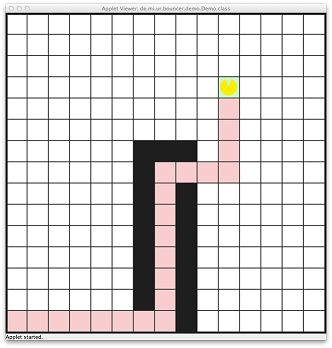
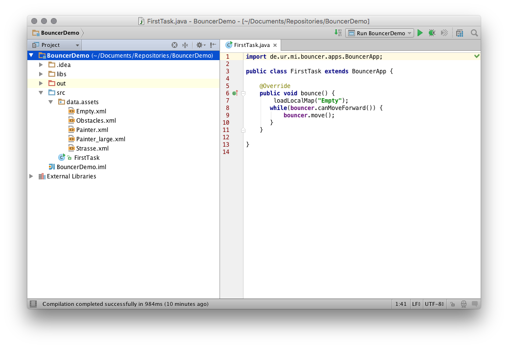

# Bouncer 

{: class=center }
<span class="img-label">Screenshot eines laufenden *Bouncer*-Programms</span>

Sie lernen in diesem Kurs die Grundlagen der objekt-orientierten
Programmierung anhand der Programmiersprache JAVA. Als Einstieg in die
Abläufe und Vorgehensweisen der Programmierung werden wir uns in den
ersten Wochen mit Bouncer beschäftigen. Bouncer ist ein Roboter, den Sie
mit der Programmiersprache JAVA und einem kleinen Set an Befehlen
steuern können. Der Roboter kann sich in einer 2-dimensionalen Welt
bewegen, Informationen zu seiner Umwelt erfragen und seine Umgebung
manipulieren. Anhand von einfachen Beispielen und Aufgaben werden Sie
lernen, Computer-Programme zu schreiben und zu verstehen. Wir vermitteln
Ihnen dabei einschlägige Grundlagen der Softwareentwicklung, die Sie im
weiteren Verlauf des Semesters zur Implementierung eigener Anwendung
einsetzen werden. Dieses Handout erklärt die wichtigsten Funktionen der
Bouncer-Umgebung und zeigt Ihnen wie Sie den Roboter in eigenen
Programmen steuern können.

## Bouncer und Karel


Bouncer ist ein Nachbau der Karel-Programmiersprache[^1] in JAVA. Die
Befehle und Strukturen, die Sie benutzen können, sind weitestgehend
deckungsgleich mit den Möglichkeiten, die Karel ihnen bietet. Das heißt,
die Lektüre von *Karel the Robot learns JAVA* von Eric Roberts[^2] hilft
Ihnen bei grundsätzlichen Verständnisproblemen. Anders als die Version
von Roberts basiert Bouncer auf denselben Grundlagen, die Sie im
späteren Verlauf des Semesters zur Entwicklung eigener Anwendungen
benutzen werden.

``` java
import de.ur.mi.bouncer.apps.BouncerApp;

public class FirstTask extends BouncerApp {

    @Override
    public void bounce () {
        loadMap("Empty");
        while (bouncer.canMoveForward () ) {
            bouncer.move();
        }
     }
}
```

## Bouncer in IntelliJ


Die einfachste Möglichkeit, eigene Bouncer-Programme zu entwickeln,
besteht darin, das Starterpaket aus dem GRIPS-Kurs herunterzuladen [und
in *IntelliJ* zu öffnen](../Starterprojekte). Nach dem Import finden Sie im
`src/demo`-Ordner des Projekts die Datei `BouncerDemo.java`, die Sie
bearbeiten können, um Bouncer zu steuern. Über die zusätzliche Datei `BouncerDemoLauncher.java` kann das in `BouncerDemo.java` verfasste Programm gestartet werden. Klicken Sie dazu mit der rechten Maustaste auf den Eintrag im Dateibaum (linke Bildschirmseite) und wählen Sie `Run 'BouncerDemoLauncher...main()'` aus.  Alternativ können Sie auch über das Menü `Run` und den dortigen Eintrag `Run` eine Liste der aktuell geöffneten Programme anzeigen lassen, und das gewünschte Bouncer-Programm durch einen Mausklick auf dessen Namen starten.

Im Ordner `data/assets` finden Sie eine Auswahl vorgefertigter
Karten. In ihrem Programm können Sie diese Karten innerhalb der
`bounce`-Methode laden, in dem Sie den Befehl `loadMap()` mit dem
entsprechenden Kartennamen (ohne *.xml*) als Parameter verwenden. Wenn
Sie eigene Karten erstellen möchten, können Sie entweder die XML-Dateien
anpassen oder den [Online-Editor](http://bouncer.regensburger-forscher.de/) verwenden und die damit
erstellte Karte in den entsprechenden Ordner kopieren.


<span class="img-label">Quellcode eines einfachen *Bouncer*-Programms</span>


## Bouncers Welt

Bouncers Welt besteht aus einer quadratischen, **2-dimensionalen
Karte**, die aus 15x15 gleich großen Feldern besteht. Jedes dieser
Felder kann mit einem eindeutigen Koordinatenpaar beschrieben werden.
Der Ursprung dieses **Koordinatensystems** liegt dabei in der oberen
linken Ecke. Dieses Feld hat die Koordinaten (0,0), das Feld in rechten
unteren Ecke die Koordinaten (14,14). Zu Beginn jedes Programms steht
Bouncer auf einem dieser Felder und kann sich schrittweise auf jedes
andere - freie - Feld bewegen. Die Felder der Karte können verschiedene
Zustände annehmen. Freie Felder werden in der Karte weiß dargestellt.
Blockierte Felder können von Bouncer nicht betreten werden. In der Karte
sind diese Felder schwarz gekennzeichnet. Freie Felder können farbig
markiert sein oder durch Bouncer eingefärbt werden. Dazu stehen drei
Farben: Rot, Grün und Blau zur Verfügung.

Innerhalb dieser Welt kann Bouncer unterschiedliche Dinge tun. Er bewegt
sich mit jedem Schritt ein Feld in die Richtung, in die er gerade
schaut. Seine Blickrichtung kann er verändern indem er sich auf der
Stelle dreht. Mit jeder Drehung rotiert er 90 gegen den Uhrzeigersinn,
kann also entweder nach Norden, Osten, Süden oder Westen schauen. Das
Feld, auf dem er gerade steht, kann er mit einer der drei Farben anmalen
oder die aktuell vorhandene Farbe entfernen.

Zusätzlich kann Bouncer Informationen zu seiner Umgebung abfragen. Er
ist in der Lage zu überprüfen, ob das Felder vor ihm oder die Felder zu
seiner Linken bzw. Rechten blockiert sind. Ebenso kann er überprüfen, ob
das Feld auf dem der Roboter steht, in einer bestimmten Farbe markiert
wurde. Schließlich kann Bouncer herausfinden, in welche Richtung er
gerade schaut.

### Aufbau des Bouncer-Programms


Jedes Bouncer-Programm besteht aus einer zentralen Klasse, die von
`BouncerApp` erbt. Innerhalb dieser Klasse gibt es eine Methode
`bounce()`. Alle Befehle, die Sie in diese Methode einfügen, werden
nacheinander abgearbeitet. Das Programm beendet die Ausführung, wenn der
letzte Befehl dieser Methode verarbeitet wurde. Innerhalb des
Bouncer-Programms können zusätzliche Methoden angelegt werden, die dann
in der `bounce()`-Methode genutzt werden können.

Ein Befehl wird nur dann ausgeführt, wenn die äußeren Bedingungen es
erlauben. Steht Bouncer vor einer Wand, wird der `move()`-Befehl nicht
ausgeführt.

``` java
import de.mi.ur.bouncer.app.BouncerApp;

// Hier beginnt die Bouncer - Klasse
public class FirstTask extends BouncerApp {
    // Bouncer bearbeitet die Befehle in dieser Methode
    public void bounce () {
        // Bouncer bewegt sich ein Feld in die Richtung, in die er schaut
        bouncer.move () ;
        // Bouncer dreht sich um 90 Grad nach links .
        bouncer.turnLeft () ;
    }
}
```

### Kommunikation mit Bouncer

Innerhalb eines Programms steuern Sie Bouncer, indem Sie ihm Kommandos
geben oder Informationen von ihm erfragen. Die so gewonnen Informationen
können Sie nutzen, um den Ablauf des Programms zu beeinflussen. Sowohl
das Geben von Kommandos als auch das Erfragen von Informationen
geschieht über verschiedene Befehle, die Sie an Bouncer richten können.
In Ihrem Programm steht Ihnen dazu ein *Objekt* mit dem Namen `bouncer`
zur Verfügung. Dieses *Objekt* bildet die Schnittstelle zu Bouncer.
Befehle an Bouncer werden immer nach dem selben Muster aufgebaut:

`bouncer.Befehl`

Für den rechten Teil dieses *Ausdrucks* können Sie verschiedene Befehle
einsetzten, die im folgenden noch genauer erklärt werden.

Je nachdem, ob Sie ein Kommando an Bouncer richten oder eine Information
erfragen geschehen unterschiedliche Dinge:

1.  Im ersten Fall versucht Bouncer, das Kommando umzusetzen. Geben Sie
    ihm etwa mit `bouncer.move()` den Befehl, sich nach vorn zu bewegen,
    so wird Bouncer versuchen dies zu tun. Falls das Feld vor ihm frei
    ist, wird er Ihren Befehl ausführen, sich nach vorne bewegen und
    befindet sich danach auf dem neuen Feld.

2.  Im zweiten Fall wird die Information, die Sie anfordern, an der
    entsprechenden Stelle Ihres Programms eingesetzt. Fragen Sie Bouncer
    etwa, ob das Feld vor ihm frei ist, so wird die entsprechende
    Information (ein Wahrheitswert, also `true` oder `false`) an der
    Stelle des Befehlsaufrufs in Ihrem Code eingesetzt. Dieses Schema
    können Sie verwenden, um über Kontrollstrukturen und Schleifen das
    Verhalten von Bouncer zu steuern.

Das folgende Beispiele verdeutlicht den grundlegenden Aufbau eines
Bouncer-Programms. Zuerst wird eine Karte mit dem Namen
BouncerDemogeladen. Anschließend bekommt Bouncer das Kommando, nach
vorne zu gehen. Im nächsten Schritt erfragen wir, ob das Feld, das sich
jetzt vor Bouncer befindet, frei ist. Wenn dies der Fall ist, erteilen
wir Bouncer erneut den Befehl, nach vorne zu gehen:

``` java
import de.mi.ur.bouncer.app.BouncerApp;

public class BouncerDemo extends BouncerApp{
	
    public void bounce() {
        loadMap("BouncerDemo")
        bouncer.move();
        if(bouncer.canMoveForward()) {
            bouncer.move();
        }
	}
    
}
```

### Befehle die Bouncer versteht 

Die folgenden Befehle können Sie innerhalb Ihres Bouncer-Programms
verwenden, um den Roboter zu steuern. Alle Befehle können in der
`bounce()`-Methode verwendet werden und auch in anderen Methoden genutzt
werden, die Sie in Ihrem Programm definieren. Beachten Sie, dass alle
Befehle mit einem Klammer-Paar `()` am Ende geschrieben werden und mit
einem Strichpunkt `;` abgeschlossen werden.

#### loadMap

Dieser Befehl lädt eine Karte. In den Klammern wird der Name der zu
ladenden Karte angegeben. Die jeweiligen Dateien müssen sich im Ordner
`data/assets` im Projekt-Verzeichnis befinden. In dem Starterpaket befindet
sich eine leere Karte, diese können Sie mit dem Befehl `loadMap("Empty")`
laden. **Anders als die übrigen Befehle wird `loadMap` nicht an Bouncer
selbst geschickt sondern direkt aufgerufen.**


``` java
public void bounce() {
    loadMap("Empty");
}
```

#### move

Mit `move()` bewegen Sie Bouncer um ein Feld in die aktuelle
Blickrichtung.

``` java
public void bounce() {
	bouncer.move();
}
```

#### turnLeft

Dieser Befehl dreht Bouncer um 90 gegen den Uhrzeigersinn. Schaut
Bouncer nach Osten (*rechts*), so dreht der Befehl ihn nach Norden.

``` java
public void bounce() {
	bouncer.turnLeft();
}
```

#### canMoveForward

Dieser Befehl gibt zurück, ob das Feld vor Bouncer frei ist und ob
Bouncer zu diesem Feld laufen kann. Der Befehl liefert einen
**Wahrheitswert** zurück, den Sie in Kontrollstrukturen und Schleifen
verwenden können.


``` java
public void bounce() {
	// Bewegt Bouncer nach vorne, wenn das Feld vor ihm frei ist.
    if(bouncer.canMoveForward()) {
        bouncer.move(); 
	}
}
```

#### canMoveLeft

Dieser Befehl überprüft, ob das Feld links neben Bouncer, ausgehend von
seiner aktuellen Blickrichtung, frei ist. Der Befehl liefert einen
**Wahrheitswert** zurück, den Sie in Kontrollstrukturen und Schleifen
verwenden können.

``` java
public void bounce() {
    // Bewegt Bouncer nach links, wenn das Feld links von ihm frei ist.
    if(bouncer.canMoveLeft()) {
        bouncer.turnLeft();
        bouncer.move(); 
    }
}
```

#### canMoveRight

Dieser Befehl überprüft, ob das Feld rechts neben Bouncer, ausgehend von
seiner aktuellen Blickrichtung, frei ist. Der Befehl liefert einen
**Wahrheitswert** zurück, den Sie in Kontrollstrukturen und Schleifen
verwenden können.

``` java
public void bounce() {
    // Bewegt Bouncer nach rechts, wenn das Feld rechts von ihm frei ist.
    if(bouncer.canMoveRight()) {
        bouncer.turnLeft();
        bouncer.turnLeft();
        bouncer.turnLeft();
        bouncer.move(); 
    }
}
```

Mit diesem Befehl können Sie überprüfen, ob das Feld vor Bouncer
blockiert ist. Der Befehl funktioniert analog zu `canMoveForward()`.

#### canNotMoveForward

```java
public void bounce() {
    // Bouncer dreht sich um, wenn das Feld vor ihm blockiert ist.
    if(bouncer.canNotMoveForward()) {
        bouncer.turnLeft();
        bouncer.turnLeft();
    }
}
```

#### canNotMoveLeft

Mit diesem Befehl können Sie überprüfen, ob das Feld links von Bouncer
blockiert ist. Der Befehl funktioniert analog zu `canMoveLeft()`.

``` java
public void bounce() {
    // Bouncer bewegt sich nach vorn, wenn das Feld links von ihm blockiert ist.
    if(bouncer.canNotMoveLeft()) {
        bouncer.move();
    }
}
```

#### canNotMoveRight

Mit diesem Befehl können Sie überprüfen, ob das Feld rechts von Bouncer
blockiert ist. Der Befehl funktioniert analog zu `canMoveRight()`.

``` java
public void bounce() {
	// Bouncer bewegt sich nach vorn, wenn das Feld rechts von ihm blockiert ist.
	if(bouncer.canNotMoveRight()) {
		bouncer.move();
	}
}
```

#### isFacingNorth

Um zu überprüfen, in welche Richtung Bouncer schaut, können Sie den
Befehl `isFacingNorth()` nutzen. Sie erhalten einen **Wahrheitswert**,
der angibt ob der Roboter nach Norden (oben) schaut.

``` java
public void bounce() {
// Bouncer bewegt sich, wenn er nach Norden schaut
	if(bouncer.isFacingNorth()) {
		bouncer.move();
	}
}
```

#### isFacingEast

Dieser Befehl funktioniert analog zu `isFacingNorth()` und gibt an, ob
Bouncer nach Osten schaut.

``` java
public void bounce() {
// Bouncer bewegt sich, wenn er nach Osten schaut
	if(bouncer.isFacingEast()) {
		bouncer.move();
	}
}
```

#### isFacingSouth

Dieser Befehl funktioniert analog zu `isFacingNorth()` und gibt an, ob
Bouncer nach Süden schaut.

``` java
public void bounce() {
// Bouncer bewegt sich, wenn er nach Sueden schaut
	if(bouncer.isFacingSouth()) {
		bouncer.move();
	}
}
```

#### isFacingWest

Dieser Befehl funktioniert analog zu `isFacingNorth()` und gibt an, ob
Bouncer nach Westen schaut.

``` java
public void bounce() {
// Bouncer bewegt sich, wenn er nach Westen schaut
	if(bouncer.isFacingWest()) {
	bouncer.move();
	}
}
```

#### paintField

Mit diesem Feld wird das Feld, auf dem Bouncer aktuell steht, farbig
markiert. In den Klammern geben Sie die Farbe an, die das Feld annehmen
soll. Ein erneuter Aufruf des Befehls mit einer anderen Farbe *übermalt*
die aktuelle Färbung des Feldes. Sie können die Farben `FieldColor.RED`
(rot), `FieldColor.GREEN` (grün) und `FieldColor.BLUE` (blau) benutzen.


``` java 
public void bounce() {
	// Bouncer malt das Feld, auf dem er aktuell steht, rot an.
    bouncer.paintField(FieldColor.RED);
    }
```

#### clearFieldColor

Mit diesem Feld löschen Sie alle Farben aus dem aktuellen Feld. Danach
wird das Feld in seinem ursprünglichen, nicht eingefärbten Zustand
angezeigt.

``` java 
public void bounce() {
	// Bouncer entfernt die Farbe des aktuellen Felds.
	bouncer.clearFieldColor();
}
```

#### isOnFieldWithColor    

Um zu überprüfen, ob das Feld, auf dem sich Bouncer momentan befindet,
eine bestimmte Farbe hat, können Sie den Befehl `isOnFieldWithColor()`
benutzen. In den Klammern geben Sie die Farbe an, die Sie überprüfen
möchten. Dabei stehen die gleichen Farben zur Verfügung, die Sie auch
für das Einfärben benutzten können. Der Befehl liefert einen
**Wahrheitswert** zurück, den Sie in Kontrollstrukturen und Schleifen
verwenden können.

``` java 
public void bounce() {
	// Bouncer bewegt sich, wenn er auf einem roten Feld steht.
    if(bouncer.isOnFieldWithColor(FieldColor.RED) {
        bouncer.move(); 
    }
}
```    

## Einige *Rezepte*


### Drehung nach Rechts

Bouncer kann sich nur nach links drehen. Eine Drehung nach rechts
erreichen Sie, in dem Sie den Roboter drei mal nach links rotieren.

``` java
bouncer.turnLeft();
bouncer.turnLeft();
bouncer.turnLeft();
```

### Umdrehen

Um sich umzudrehen, muss sich Bouncer zwei mal nach links drehen und
schaut danach in die entgegengesetzt Richtung.

``` java
bouncer.turnLeft();
bouncer.turnLeft();
```

### Bis zum nächsten Hindernis laufen

Mit dieser Schleife läuft Bouncer solange nach vorn, bis er auf ein
Hindernis stößt.

``` java
while(bouncer.canMoveForward()) {
	bouncer.move();
}
```

[^1]: <http://en.wikipedia.org/wiki/Karel_(programming_language)>

[^2]: <http://web.stanford.edu/class/cs106a/materials/karel-the-robot-learns-java.pdf>